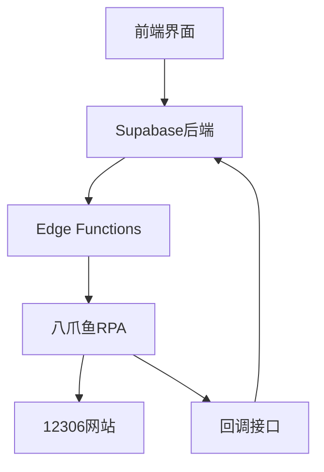

# 12306抢票助手项目概述

## 项目目的
开发一个基于RPA的12306抢票助手，通过自动化操作实现车票预订功能。

## 技术栈
- 前端：React + TypeScript + Tailwind CSS + shadcn/ui
- 后端：Supabase (PostgreSQL + Edge Functions)
- 自动化：八爪鱼RPA

## 系统架构

```mermaid
graph TD
    A[前端界面] --> B[Supabase后端]
    B --> C[Edge Functions]
    C --> D[八爪鱼RPA]
    D --> E[12306网站]
    D --> F[回调接口]
    F --> B
```