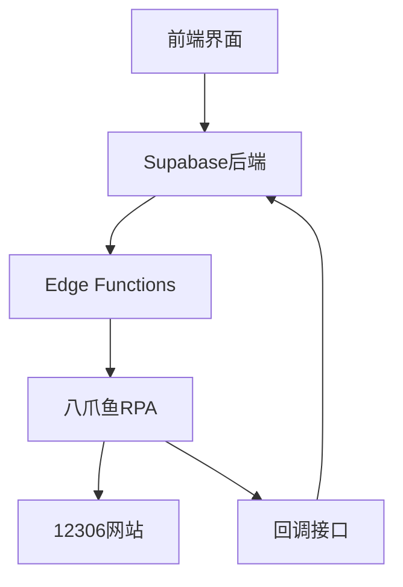

# 12306抢票助手项目文档

## 一、项目概述

### 1.1 项目目的
开发一个基于RPA的12306抢票助手，通过自动化操作实现车票预订功能。

### 1.2 技术栈
- 前端：React + TypeScript + Tailwind CSS + shadcn/ui
- 后端：Supabase (PostgreSQL + Edge Functions)
- 自动化：八爪鱼RPA

### 1.3 系统架构


## 二、数据库设计

### 2.1 数据表结构

#### watch_tasks（抢票任务表）
```sql
create table watch_tasks (
    id uuid default uuid_generate_v4() primary key,
    user_id uuid references auth.users not null,
    from_station varchar not null,
    to_station varchar not null,
    travel_date date not null,
    preferred_trains text[], -- 优先车次
    seat_types text[], -- 座位类型优先级
    passenger_ids text[], -- 乘客证件号
    status varchar not null default 'active',
    rpa_webhook_url varchar, -- RPA服务的Webhook URL
    rpa_callback_url varchar, -- RPA回调URL
    created_at timestamp with time zone default now(),
    updated_at timestamp with time zone default now()
);
```

#### rpa_tasks（RPA执行记录表）
```sql
create table rpa_tasks (
    id uuid default uuid_generate_v4() primary key,
    watch_task_id uuid references watch_tasks not null,
    status varchar not null default 'pending',
    rpa_machine_id varchar,
    enterprise_id uuid,
    flow_id varchar,
    flow_process_no varchar,
    start_time timestamp with time zone,
    end_time timestamp with time zone,
    result jsonb,
    error_message text,
    created_at timestamp with time zone default now(),
    updated_at timestamp with time zone default now()
);
```

### 2.2 状态定义
- watch_tasks.status:
  - active: 活跃
  - completed: 完成
  - failed: 失败
  - stopped: 已停止

- rpa_tasks.status:
  - pending: 等待中
  - running: 执行中
  - completed: 完成
  - failed: 失败

## 三、RPA接口规范

### 3.1 触发RPA任务
```typescript
// 请求URL
POST https://api-rpa.bazhuayu.com/api/v1/bots/webhooks/{webhookId}/invoke

// 请求头
Content-Type: application/json

// 请求体
{
    "sign": "HmacSHA256签名后Base64编码",
    "timestamp": "1704321234",
    "params": {
        "fromStation": "北京",
        "toStation": "上海",
        "travelDate": "2024-01-20",
        "trainNumber": "G1234",
        "seatType": "二等座",
        "callbackUrl": "回调地址"
    }
}

// 响应体
{
    "enterpriseId": "企业ID",
    "flowId": "流程ID",
    "flowProcessNo": "流程实例号"
}
```

### 3.2 RPA回调接口
```typescript
// 请求URL
POST {callbackUrl}

// 请求头
Content-Type: application/json

// 请求体
{
    "taskId": "RPA任务ID",
    "success": true,  // 或false
    "error": "错误信息（失败时）"
}
```

### 3.3 签名算法
```typescript
function getSign(secret: string, timestamp: string): string {
  const stringToSign = `${timestamp}\n${secret}`;
  return crypto
    .createHmac('sha256', stringToSign)
    .update(Buffer.from(''))
    .digest('base64');
}
```

## 四、前端组件

### 4.1 组件结构
```
src/
├── components/
│   ├── UserProfile.tsx       // 用户信息管理
│   ├── CommutePreferences.tsx// 乘车偏好设置
│   └── TicketMonitor.tsx     // 任务状态监控
├── types/
│   ├── supabase.ts          // 数据库类型定义
│   └── components.ts        // 组件Props类型定义
└── integrations/
    └── supabase/
        └── client.ts        // Supabase客户端配置
```

### 4.2 类型定义
```typescript
// 任务数据类型
export interface TaskData {
  fromStation: string;
  toStation: string;
  trainNumber?: string;
  seatTypes: string[];
}

// 组件Props类型
export interface CommutePreferencesProps {
  onStartTask: (data: TaskData) => Promise<void>;
  onStopTask: () => void;
  isTaskRunning: boolean;
}
```

## 五、环境配置

### 5.1 必需的环境变量
```env
# Supabase配置
VITE_SUPABASE_URL=你的Supabase项目URL
VITE_SUPABASE_ANON_KEY=你的Supabase匿名密钥

# RPA配置
VITE_RPA_WEBHOOK_URL=https://api-rpa.bazhuayu.com/api/v1/bots/webhooks/{webhookId}/invoke
RPA_SIGN_KEY=你的RPA签名密钥

# API配置
VITE_API_URL=你的API基础URL
```

### 5.2 RPA配置步骤
1. 登录八爪鱼RPA平台
2. 创建新的Webhook触发器
3. 配置运行机器人
4. 获取Webhook URL和签名密钥
5. 设置环境变量

## 六、部署指南

### 6.1 数据库部署
```bash
# 部署数据库迁移
supabase db push

# 部署RLS策略
supabase db push --policy-only
```

### 6.2 Edge Functions部署
```bash
# 部署触发器函数
supabase functions deploy trigger-rpa

# 部署回调处理函数
supabase functions deploy rpa-callback
```

### 6.3 前端部署
```bash
# 安装依赖
npm install

# 构建生产版本
npm run build

# 部署到你的托管服务
npm run deploy
```

## 七、开发指南

### 7.1 本地开发
```bash
# 克隆项目
git clone <项目地址>

# 安装依赖
npm install

# 启动开发服务器
npm run dev
```

### 7.2 测试RPA连接
```bash
# 运行测试脚本
node test/test-rpa.js
```

### 7.3 调试技巧
1. 使用Supabase仪表板监控数据库
2. 使用Edge Functions日志调试接口
3. 使用RPA平台的任务日志
4. 前端开发工具的React开发者工具

## 八、注意事项

### 8.1 安全性
1. 所有敏感信息必须加密存储
2. RPA接口必须验证签名
3. 回调接口需要验证来源
4. 使用RLS保护数据访问

### 8.2 性能优化
1. 使用Supabase实时订阅而不是轮询
2. 合理设置RPA任务超时时间
3. 实现任务队列管理
4. 添加错误重试机制

### 8.3 维护建议
1. 定期更新依赖包
2. 监控12306接口变化
3. 备份重要数据
4. 记录详细的操作日志

## 九、故障排除

### 9.1 常见问题
1. RPA连接失败
   - 检查Webhook URL是否正确
   - 验证签名是否正确
   - 确认RPA机器人是否在线

2. 数据库错误
   - 检查类型定义是否匹配
   - 验证RLS策略是否正确
   - 确认数据库连接状态

3. 前端问题
   - 检查环境变量配置
   - 验证API响应格式
   - 查看控制台错误日志

### 9.2 解决方案
1. 使用测试脚本验证RPA连接
2. 检查Supabase日志
3. 查看RPA执行日志
4. 使用开发者工具调试
